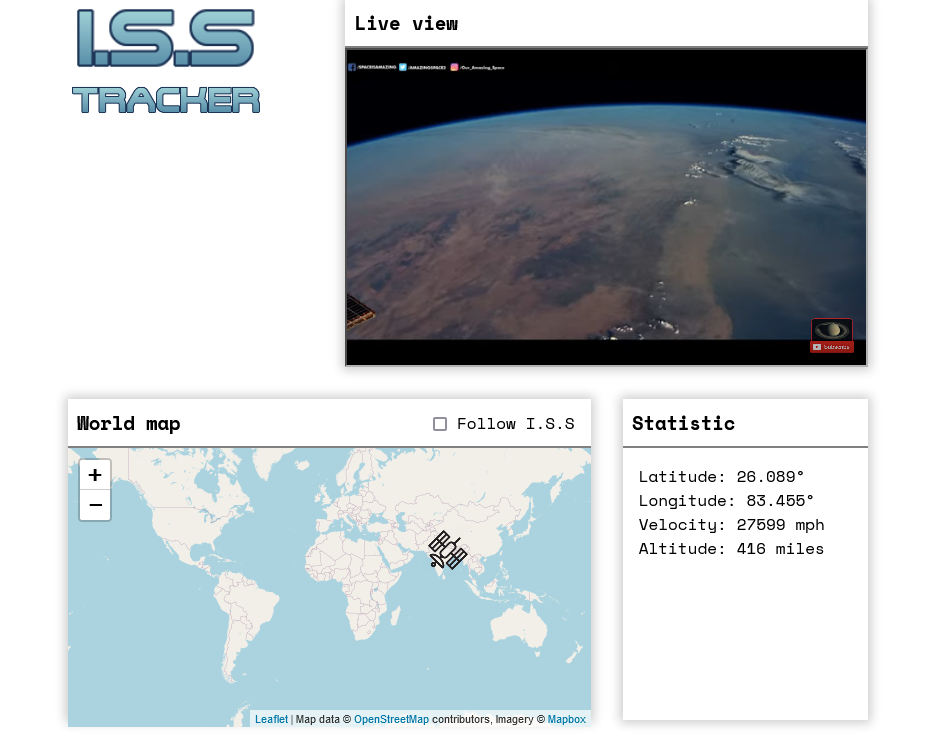

# ISS Tracker

This is a webapp use to track the International Space Station
Live webpage: https://francisphamsd.github.io/iss-tracker/

## Table of contents

- [Overview](#overview)
  - [The challenge](#the-challenge)
  - [Screenshot](#screenshot)
  - [Links](#links)
- [My process](#my-process)
  - [Built with](#built-with)
  - [What I learned](#what-i-learned)
  - [Continued development](#continued-development)
  - [Useful resources](#useful-resources)
- [Author](#author)
- [Acknowledgments](#acknowledgments)

## Overview

The I.S.S Tracker app track the I.S.S by fetching the latitude and longitude api from wheretheiss.at. The locations are then mapped in realtime using leaflet.js.

### The challenge

- Structure webpage with grid
- Style it with scss
- Fetching API and get data
- Mapping location of ISS with leaflet.js

### Screenshot

### Links

- Github URL:(https://github.com/francisphamsd/iss-tracker.git)
- Live Site URL: (https://francisphamsd.github.io/iss-tracker/)

## My process

First, I have to think about the component I need on the website, this include the logo, the youtube live video, the map, and the location statistic. To get the latitude and longitude from the api, I use api.wheretheiss.at website. Then plot it with leaflet.js map. The map then track the I.S.S in realtime. wheretheiss.at can also track the velocity and altitude of the I.S.S, these statistic are also shown in realtime in the website.

### Built with

- Semantic HTML5 markup
- SCSS custom properties
- CSS Grid
- Valnila Javascript
- api.wheretheiss.at
- leafletjs.com

### What I learned

Through this project, I got more practice with SCSS. I also learn how to fetch api online and use that data to work with a map database like leaflet.js

### Continued development

In the future, I might add more option to the map such as:

- Convert unit from metric to imperial
- Adding more theme like light and dark mode
- Adding responsiveness for mobile and tablet

### Useful resources

- [I.S.S location api](https://wheretheiss.at/w/developer) - This doc show me how to get the api and integrate it with JS
- [Leaflet.js](https://leafletjs.com/reference.html) - This is a doc for leaflet.js. They have reference on how to set the marker and zoom the map
- [The coding train youtube channel](https://www.youtube.com/c/TheCodingTrain) - Big thanks to Daniel Shiffman from the coding train for providing the tutorial for this project

## Author

- Website - [Frank Pham](https://www.franciswebdev.com)
- Github - [francisphamsd](https://github.com/francisphamsd)

## Acknowledgments

Thank you Danial from the Coding Train on Youtube for the tutorial.
